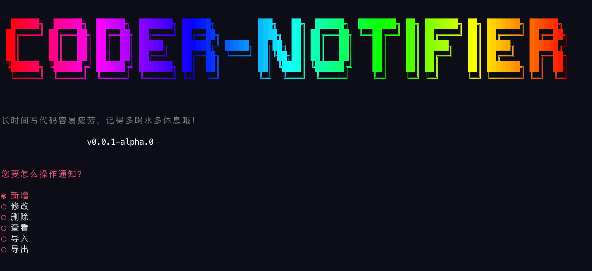
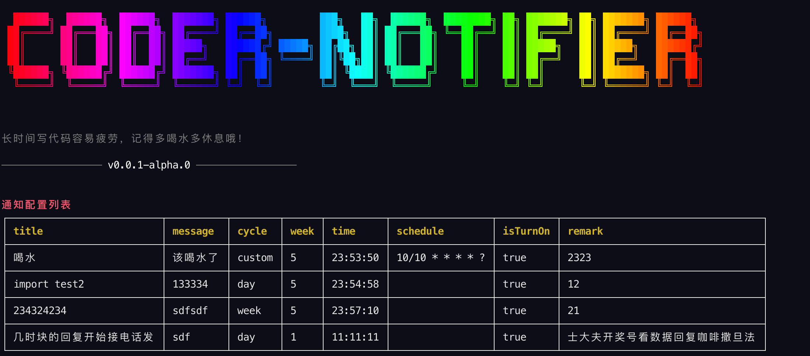
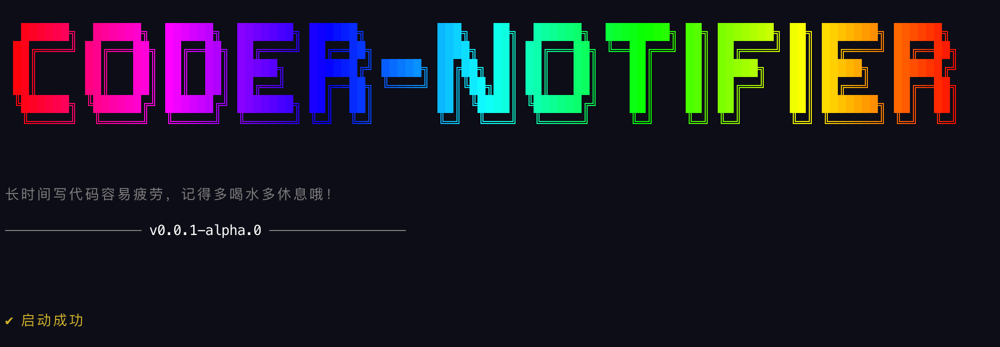
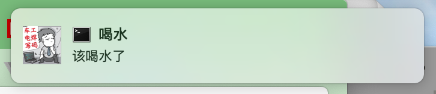

# coder-notifier

> 一款定时提醒工具，如果你经常忘记喝水休息，这很管用。
---------
[](https://npmjs.com/package/coder-nofitier)

## 安装

```bash
$ npm install --global coder-notifier
```

## 快速开始
如果您没有安装[Nodejs](https://nodejs.org/)，请先安装。

```bash
# 帮助文档
$ coder-notifier --help

# 设置您的通知
$ coder-notifier set

# 启动
$ coder-notifier start
```

## 高级用法

```bash
# 持久化运行，开机自启动。
$ coder-notifier save

# 取消持久化运行。
$ coder-notifier stop

# 关于我们
$ coder-notifier about
```

## 效果展示
```bash
# 设置您的通知
$ coder-notifier set
```



```bash
$ coder-notifier start
```




## 常见问题
1. 在Windows系统中运行命令提示“无法加载文件**因为在此系统上禁止运行脚本。有关详
细信息...”

    > 以管理员的身份运行 Power Shell 然后输入 `set-ExecutionPolicy RemoteSigned` 出现提示后再输入 `A` 即可。

2. 在Windows系统下运行 `coder-notifier save` 时报错`Error: EPERM: operation not permitted, symlink '****\win-save.bat' -> 'C:\ProgramData\Microsoft\Windows\Start Menu\Programs\Startup\win-save-link.bat'`。

    > 请以管理员身份打开 `Power Shell` 或者 `CMD` 再运行`coder-notifier save`。

3. 在Windows系统下运行 `coder-notifier save` 是部分杀毒软件提示风险。

    > 因为需要写入开机启动快捷方式到系统盘，所以杀毒软件会检测，直接允许就行了。

4. 在Windows系统下多次运行 `coder-notifier save` 导致启动多个进程频繁通知。

    > 可以使用 `coder-notifier stop` 命令停止掉所有进程，然后再运行一次 `coder-notifier save` 命令。

5. 在Windows系统下多次运行 `coder-notifier save` 会打开一个新窗口。

    > 因为Windows系统机制导致隐藏的窗口无法发送通知，所以需要保持窗口为打开状态。


## 功能进展
- [x] 通知功能
- [x] 自动启动功能
- [x] 导入导出设置功能
- [ ] 用户自定义定时插件功能
